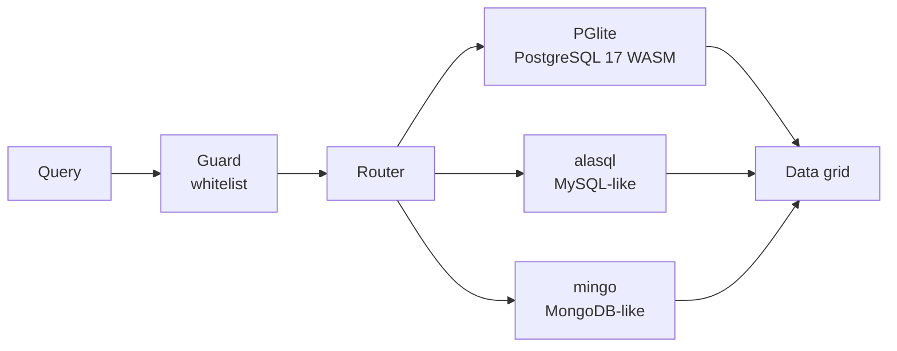

# Database Playground — MBCS201

Хичээлийн 16 долоо хоногийн бүх сэдвийг хамарсан, browser дотор ажилладаг
өгөгдлийн сангийн интерактив орчин. **PostgreSQL, MySQL, MongoDB** гэсэн
3 системд ижил дата дээр query бичиж, үр дүнг харьцуулж үзнэ.

## Хурдан эхлэх

```bash
pnpm install
pnpm dev          # http://localhost:3000
```

`/playground` руу ороход бэлэн.

## Хэрхэн ажилладаг

Сервер огт байхгүй. Бүх query таны browser дотор ажиллана.



| Систем | Engine | Тайлбар |
|---|---|---|
| **PostgreSQL 17** | `@electric-sql/pglite` | Жинхэнэ Postgres, WebAssembly-д. `SELECT version()` → жинхэнэ хувилбар. Transaction, EXPLAIN ANALYZE, window function бүгд ажиллана. |
| **MySQL** | `alasql` | MySQL-ийн синтакс (LIMIT, backtick, IFNULL). 100% JS, хөнгөн. |
| **MongoDB** | `mingo` | `$gt`, `$in`, `$regex` operator болон `$group`, `$lookup` pipeline. |

## 5 төслийн сэдэв

Хичээлийн Mini Project-ийн шаардлагаар:

| Сэдэв | Хүснэгт | Мөр |
|---|---|---|
| Номын сан | authors, books, categories, loans, members | 468 |
| Цахим дэлгүүр | categories, customers, order_items, orders, products | 998 |
| Эмнэлэг | appointments, departments, doctors, patients, prescriptions | ~1070 |
| Их сургууль | courses, departments, enrollments, instructors, students | ~1650 |
| Зочид буудал | bookings, guests, payments, room_types, rooms | ~1030 |

Сэдэв солиход 3 системд **ижил schema, ижил дата** автоматаар бэлдэгдэнэ.

## Файлын бүтэц

```
src/
  app/
    page.tsx                  Нүүр — төслийн танилцуулга
    playground/page.tsx       Үндсэн ажлын талбар
  components/
    DbProvider.tsx            Төлөвийн удирдлага (domain, db, query, history)
    Playground.tsx            Гурван баганат бүтэц
    QueryEditor.tsx           CodeMirror 6 — SQL/Mongo editor
    ResultGrid.tsx            Үр дүнгийн хүснэгт (эрэмбэлэх, CSV, хуулах)
    SchemaExplorer.tsx        Хүснэгт, багана, PK/FK
    ExamplePanel.tsx          Жишээ query + дасгал
    ErrorPanel.tsx            Алдааг монгол зөвлөгөөтэй харуулах
  lib/
    guard.ts                  Query whitelist (аюулгүй байдал)
    seed.ts                   Тогтвортой seed generator
    types.ts                  Нийтлэг төрлүүд
    engines/
      pglite.ts               PostgreSQL engine
      mysql.ts                MySQL engine
      mongo.ts                MongoDB engine + shell parser
      index.ts                Facade — 3 engine-ийг нэгтгэнэ
    schema/
      library.ts, shop.ts, hospital.ts, university.ts, hotel.ts
      index.ts                Бүх domain
```

## Хичээлийн хэрэглээ

**Багшид:**
- Seed нь тогтвортой (`seedrandom`) — бүх оюутан яг ижил үр дүн харна.
  Та хариултыг урьдчилан мэдэж, шалгаж чадна.
- Дасгал бүр «Хариулт» товчтой — `Хариултыг ажиллуулж шалгах` дарж
  шалгуурыг шууд батална.
- `Дата сэргээх` товч нь оюутан `DELETE` бичсэн ч анхны байдалд буцаана.

**Оюутанд:**
- `Ctrl` + `Enter` — query ажиллуулах
- Текст сонгоод `Ctrl` + `Enter` — зөвхөн сонгосон хэсэг
- Зүүн талаас хүснэгт дээр дарж `SELECT * FROM ...` автоматаар оруулна
- Баруун талаас жишээ сонгож, өөрчилж туршина

## Жишээнүүдийн ангилал

Баруун самбарт **6 ангилалын шүүлтүүр** байна:

| Ангилал | Юу хамарна | Долоо хоног |
|---|---|---|
| **Хүснэгт (DDL)** | `CREATE TABLE`, `ALTER TABLE ADD/DROP COLUMN`, `ALTER COLUMN TYPE`, `ADD/DROP CONSTRAINT`, `DROP TABLE` | 4 |
| **Мөр (DML)** | `INSERT` (нэг/олон), `INSERT ... SELECT`, `UPDATE`, `UPDATE ... FROM`, `DELETE`, `ON CONFLICT` (UPSERT) | 6 |
| **Асуулга** | `SELECT`, `WHERE`, `JOIN`, `GROUP BY`, `HAVING`, subquery, `EXISTS` | 5–10 |
| **Транзакц** | `BEGIN`, `COMMIT`, `ROLLBACK`, ACID | 13 |
| **View / Index** | `CREATE VIEW`, `CREATE INDEX`, `EXPLAIN ANALYZE` | 12 |
| **Нормалчлал** | 0NF → 1NF → 2NF → 3NF, anomaly | 11 |

⚠️ **Датаг өөрчлөх жишээ** (DDL/DML) нь шар анхааруулгын тэмдэгтэй.
Ажиллуулсны дараа «Дата сэргээх» товчоор буцаана.

## Нормалчлалын жишээ (1NF → 2NF → 3NF)

Энэ бол хичээлийн хамгийн чухал хэсэг. 5 үе шаттай:

**0. Нормалчлаагүй (0NF)** — зориуд буруу хүснэгт:

```sql
CREATE TABLE loans_unnormalized (
  member_name  VARCHAR(100),   -- "Болд Сараа" — овог, нэр холилдсон
  book_titles  TEXT,           -- "Ном А, Ном Б" — ОЛОН утга нэг баганад
  librarian    VARCHAR(50)     -- Санчий бүрд ДАВТАГДАНА
);
```

Дөрвөн асуудал: атом бус утга, давхардал, шинэчлэлийн anomaly, устгалын anomaly.

**1. 1NF** — атом утга:

```sql
CREATE TABLE loans_1nf (
  loan_id     SERIAL PRIMARY KEY,
  book_title  VARCHAR(200) NOT NULL,  -- ✅ Нэг ном
  loan_date   DATE NOT NULL           -- ✅ Нэг огноо
);
```

**2. 2NF** — давхардлыг тусдаа хүснэгт болгох:

```sql
CREATE TABLE members_nf2 (member_id SERIAL PRIMARY KEY, full_name VARCHAR(100), city VARCHAR(50));
CREATE TABLE books_nf2   (book_id SERIAL PRIMARY KEY, title VARCHAR(200));
CREATE TABLE loans_nf2   (loan_id SERIAL PRIMARY KEY, member_id INT REFERENCES members_nf2(member_id), ...);
```

"Улаанбаатар" 5 удаа → 2 удаа, "Дорж" 3 удаа → 1 мөр.

**3. 3NF** — дам хамаарлыг арилгах:

```sql
-- Асуудал: member_id → city → postal_code  (транзитив!)
CREATE TABLE cities_nf3 (
  city_id     SERIAL PRIMARY KEY,
  name        VARCHAR(50) NOT NULL UNIQUE,
  postal_code VARCHAR(10)       -- ХОТООС хамаарна, гишүүнээс биш
);
CREATE TABLE members_nf3 (
  member_id  SERIAL PRIMARY KEY,
  last_name  VARCHAR(50) NOT NULL,
  first_name VARCHAR(50) NOT NULL,
  city_id    INT NOT NULL REFERENCES cities_nf3(city_id)  -- ✅ Зөвхөн ID
);
```

Одоо хотын шуудангийн код солиход **нэг мөр** шинэчлэгдэнэ (өмнө 50,000).

**Харьцуулалт:**

| | 0NF | 1NF | 2NF | 3NF |
|---|---|---|---|---|
| Гишүүн "Улаанбаатар" | 3 давтах | 5 давтах | 3 давтах | 2 давтах |
| Олон утга нэг нүдэнд | ❌ | ✅ | ✅ | ✅ |
| Хот шинэчлэх | 5 мөр | 5 мөр | 3 мөр | **1 мөр** |
| Хүснэгт | 1 | 1 | 4 | 5+ |

⚠️ Хүснэгтийн тоо 1 → 5 болж өссөн — энэ бол нормалчлалын ҮНЭ. Гэхдээ
давхардал, anomaly-гүй болсноор ашиг нь илүү.

## Олон statement ажиллуулах

Нэг `Run` дарахад олон statement ажиллана — нормалчлалын жишээнд
зайлшгүй:

```sql
DROP TABLE IF EXISTS loans_1nf CASCADE;
CREATE TABLE loans_1nf (...);
INSERT INTO loans_1nf (...) VALUES (...);
SELECT * FROM loans_1nf;
```

**Хамгаалалт:** statement БҮРИЙГ тус тусад нь шалгана. Аль нэг нь
хориглосон бол **бүгдийг** хориглоно — `SELECT 1; DROP DATABASE x`
гэх мэт залилаас сэргийлнэ.

## Аюулгүй байдал

Гурван давхарга:

1. **Query нь зөвхөн `mem:` (in-memory) дотор ажиллана.** Файл системд
   хүрэх боломжгүй.
2. **PGlite нь browser-ийн WebAssembly sandbox дотор.** OS-д хүрэх
   боломжгүй.
3. **Server огт байхгүй.** Халдах зүйл байхгүй.

Guard нь нэмэлт хамгаалалт болон ойлгомжтой монгол алдаа өгнө:

| Хориглосон | Шалтгаан |
|---|---|
| `DROP DATABASE` | Бүх датаг устгана |
| `COPY ... FROM PROGRAM` | Системийн програм ажиллуулна |
| `pg_read_file()`, `pg_ls_dir()` | Файл систем уншина |
| `CREATE EXTENSION` | Өргөтгөл суулгана |
| `$where`, `mapReduce` | Дурын JavaScript ажиллуулна |
| Олон statement (`;`) | Нэг удаад нэг л query |

## Тест

```bash
pnpm test         # 81 тест
```

| Файл | Юу шалгана |
|---|---|
| `guard.spec.ts` | SQL/NoSQL whitelist, literal escape, олон statement, LIMIT логик |
| `mongo.spec.ts` | Mongo shell parser (`find`, `aggregate`, chaining) |
| `mingo-init.spec.ts` | mingo-гийн бүх pipeline operator бүртгэл (`$group`, `$lookup`, ...) |
| `schema/index.spec.ts` | 5 домэйн, хичээлийн шаардлага (JOIN, aggregate, VIEW, transaction) |
| `schema/examples.spec.ts` | Ангилал, `mutates` тэмдэг, нормалчлалын 4 үе шат, SQL синтакс |
| `engines/index.spec.ts` | 3 engine ижил дата дээр, RESET, NUMERIC coercion, олон statement, 1NF→3NF |

## Техникийн шийдлүүд

**Тогтвортой seed.** `seedrandom` нь домэйн тус бүрд тогтмол seed
(`library-v1`, `shop-v1`, ...) ашиглана. Хуудас refresh хийхэд дата
өөрчлөгдөхгүй, бүх хүүхэд ижил үр дүн харна.

**`NUMERIC` → тоо хөрвүүлэлт (типээр).** PostgreSQL-ийн `NUMERIC` нь
JS-д string болж ирдэг (нарийвчлал хамгаалахын тулд). Гэхдээ mingo-гийн
`$avg`, alasql-ийн `AVG()` нь зөвхөн `number` дээр ажилладаг.

⚠️ Гэхдээ БҮХ string-ийг тоо болгох нь БУРУУ:

```
postal_code VARCHAR(10)  '210001'   → 210001 болвол '210001' = 210001 унана
phone       VARCHAR(20)  '99112233' → 99112233 болвол Grid-д салангид харагдана
```

Тиймээс шийдэл нь **баганын төрлийг тодорхойлж, зөвхөн жинхэнэ тоон
төрлийг** (`numeric`, `decimal`, `real`, `integer`) number болгох.
PGlite-ийн `fields[].dataTypeID` (OID) → төрлийн нэр → шийдвэр.
VARCHAR/TEXT нь **string хэвээр** үлдэнэ.

**Олон statement.** Guard нь statement бүрийг тус тусад нь шалгаж,
аль нэг нь хориглосон бол бүгдийг хориглоно. PostgreSQL-д `db.query()`
нь зөвхөн нэг statement хүлээж авдаг тул: нэг бол `query()`, олон бол
`exec()` + сүүлийн SELECT-ийг тусад нь ажиллуулна.

**`db.exec` ба нэг transaction.** PGlite-ийн `exec` нь олон statement-ийг
нэг implicit transaction-д багцлана. Тиймээс DDL ба seed-ийг нэг дор
ажиллуулах ёстой — тэгэхгүй бол seed доторх FK алдаа нь DDL-ийг ч
цуцалж, «relation does not exist» алдаа гарна. Statement-уудыг
`;`-ээр хувааж batch хийх нь `books.author_id → authors` FK-ийн
дарааллыг эвддэг тул хориглоно.

**CodeMirror keymap.** `Ctrl+Enter` нь React-ийн DOM listener биш,
CodeMirror-ийн `EditorView.domEventHandlers` extension-ээр бүртгэгдэнэ.
DOM listener нь `key` солигдох үед алдагдаж, «query ажиллахгүй байна»
гэсэн төөрөгдөл үүсгэдэг.

**React StrictMode.** Development-д effect хоёр удаа дуудагдана.
`loadDomain` нь lock-той (ижил domain-д нэг promise), `DbProvider` нь
`loadedDomainRef`-ээр давхар ачааллыг сэргийлнэ. Хэрэв үгүй бол
`CREATE TABLE` хоёр удаа ажиллаж, «already exists» алдаа гарна.

## Vercel дээр байршуулах

`next.config.mjs` нь `output: 'export'` — бүх зүйл статик.

```bash
pnpm build        # out/ фолдер үүснэ
```

Vercel-д:

1. GitHub-д push хийнэ
2. Vercel → New Project → repo сонгоно
3. **Framework: Next.js** (автоматаар танина)
4. Deploy — ямар ч environment variable шаардлагагүй

Эхний ачаалалт ~3MB WASM татна (нэг л удаа, дараа нь CDN-ээс кэшлэгдэнэ).

## Хязгаарлалт

- **MySQL нь жинхэнэ биш** — `alasql` engine. `EXPLAIN`, stored procedure,
  transaction бүрэн дэмжигдэхгүй. SELECT/JOIN/GROUP BY ажиллана.
- **MongoDB нь жинхэнэ биш** — `mingo`. BSON, sharding, replica set
  байхгүй. Query хэл ижил, гэхдээ `$where` хориглосон.
- **Дата нь табыг хаахад устана.** `memory://` горим — энэ нь зориуд,
  ингэснээр хэрэглэгч бүр цэвэр орчинтой.

## Лиценз

Хичээлийн зориулалттай. MBCS201 — Database.
